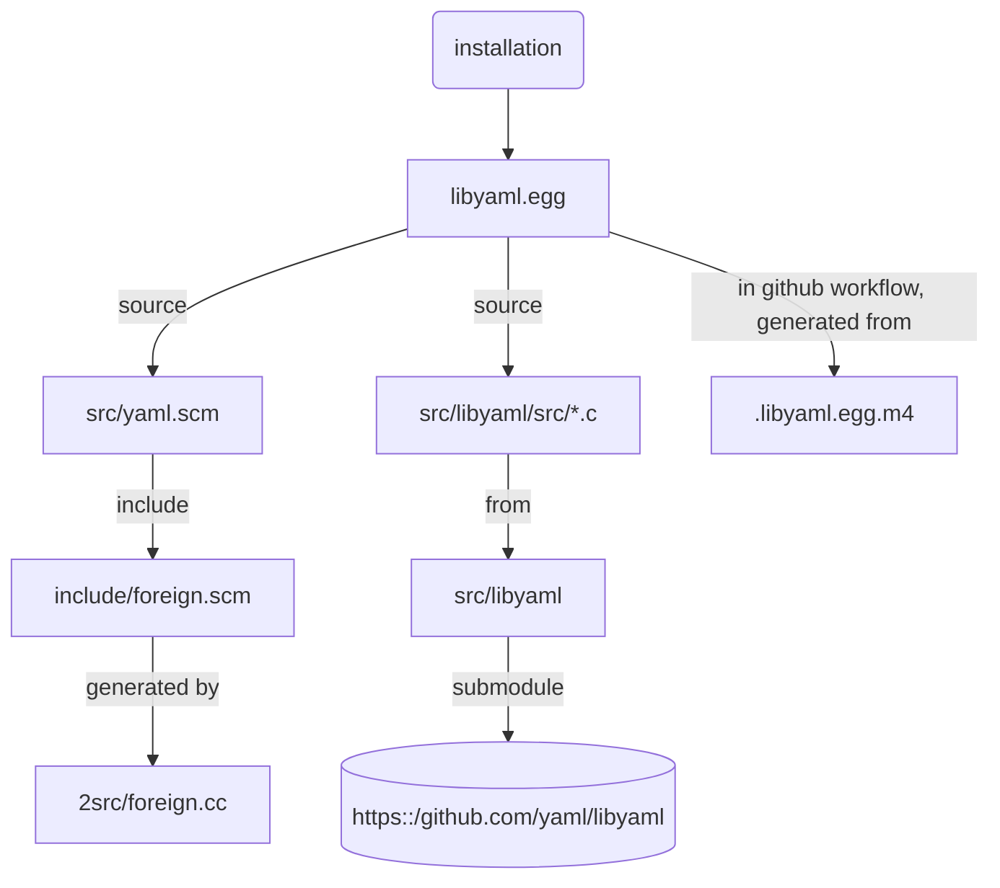

# libyaml.scm

## Overview

```mermaid
flowchart


include/foreign.scm -- generated by --> 2src/foreign.cc
src/yaml.scm --include--> include/foreign.scm

src/libyaml/src/*.c --from--> src/libyaml
--submodule--> yaml/libyaml[(https::/github.com/yaml/libyaml)]

libyaml.egg -- in github workflow, generated from--> .libyaml.egg.m4
libyaml.egg --source--> src/yaml.scm
libyaml.egg --source--> src/libyaml/src/*.c

END(installation)
END --> libyaml.egg
```
